<div align="center">

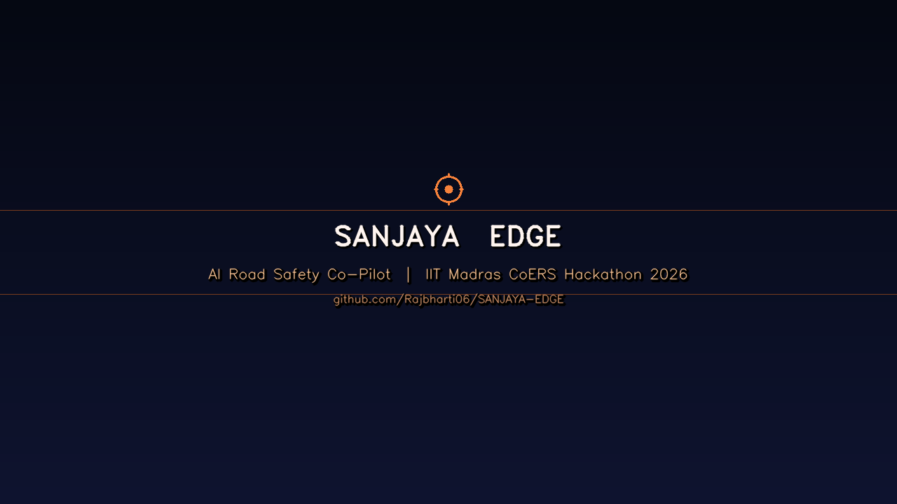

# SANJAYA EDGE

### AI Road Safety Co-Pilot
**IIT Madras CoERS Road Safety Hackathon 2026 · DriveLegal Track**

[](https://python.org)
[](https://fastapi.tiangolo.com)
[](https://ultralytics.com)
[](https://react.dev)

> **Detects road traffic violations in real time, names the exact law section broken, and announces the applicable state-level fine — all within milliseconds of the violation occurring.**

</div>

---

## Demo

> *Hello everyone — this is how it works*

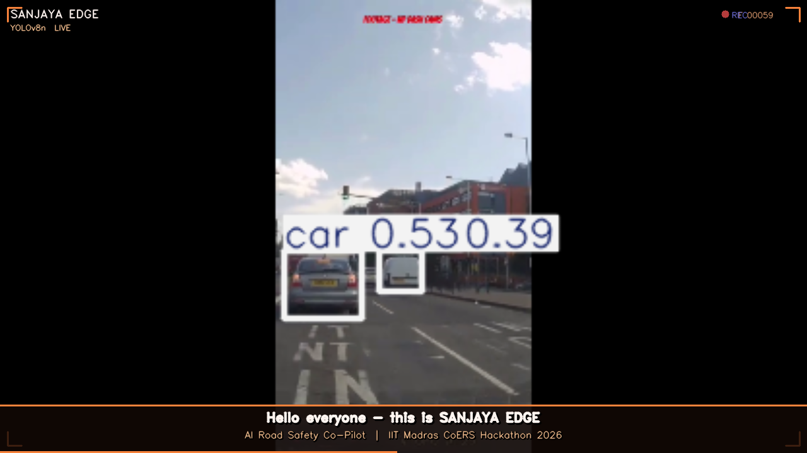

*Opening frame: 5 real-time detectors scanning a live Indian traffic intersection*

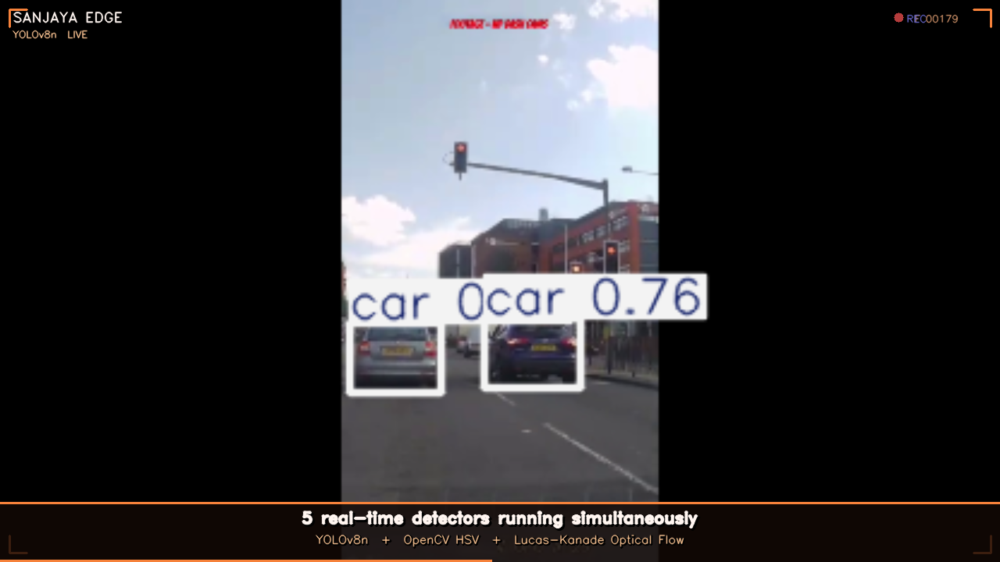

*YOLOv8n + OpenCV HSV + Lucas-Kanade Optical Flow — all running simultaneously*

---

## Detector 1 — Red Light Jump

> **MVA Section 119 · Fine: Rs.1,000 (1st offence) / Rs.2,000 (repeat)**

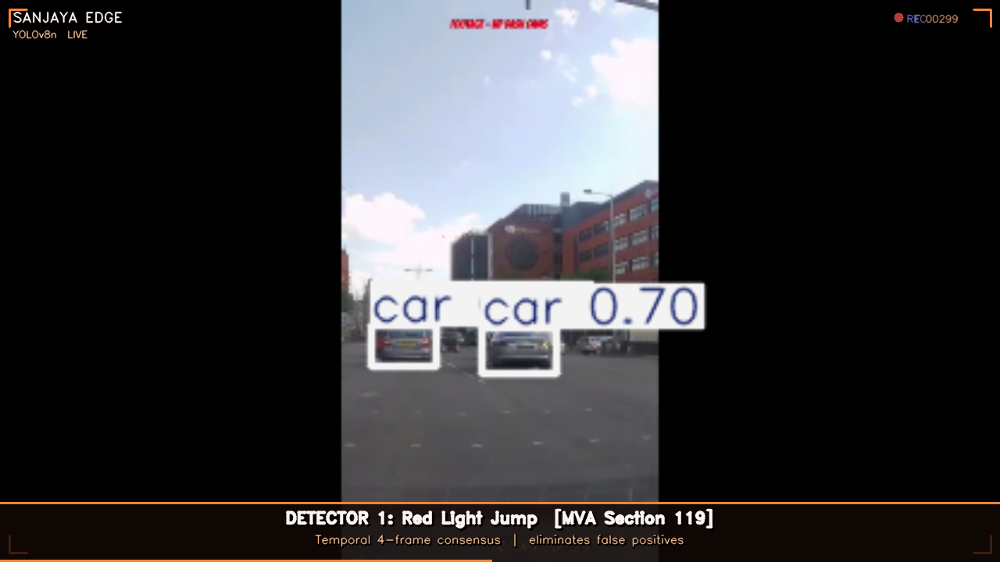

**How it works:**
1. YOLOv8n detects the traffic light bounding box (COCO class 9)
2. The ROI is split into top / mid / bottom thirds in HSV colour space
3. Red pixel density + brightness position confirms the colour
4. A **4-frame temporal consensus** commits to a state — single-frame flickers are discarded
5. When a vehicle enters the intersection zone while light is confirmed red → **CRITICAL ALERT**

---

## Detector 2 — Helmet Violation

> **MVA Section 129 · Fine: Rs.1,000 + 3-month licence suspension**

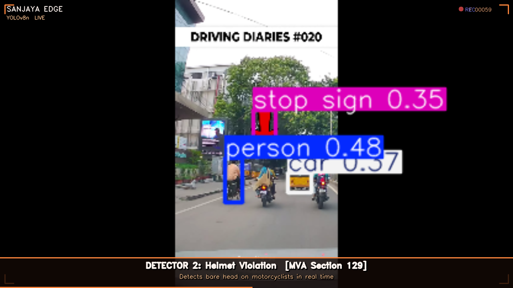

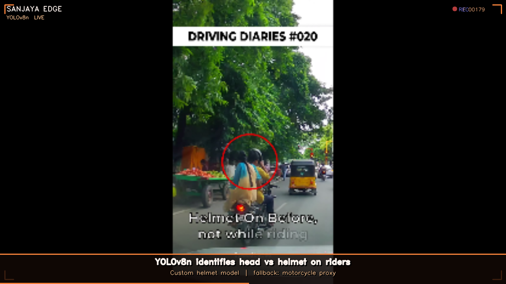

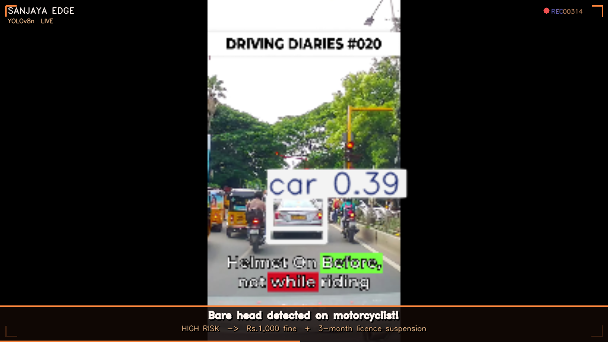

**How it works:**
1. Custom YOLOv8 model classifies each rider: `head` / `helmet` / `person`
2. If `head` class detected (bare head) with confidence > 38% → **HIGH RISK ALERT**
3. Fallback: if no custom model loaded, motorcycle detection proxy triggers compliance warning
4. Voice co-pilot (Web Speech API, `en-IN`) announces the violation and exact fine instantly

---

## Detector 3 — Wrong-Side Driving

> **MVA Section 184 · Fine: Rs.5,000 (dangerous driving)**

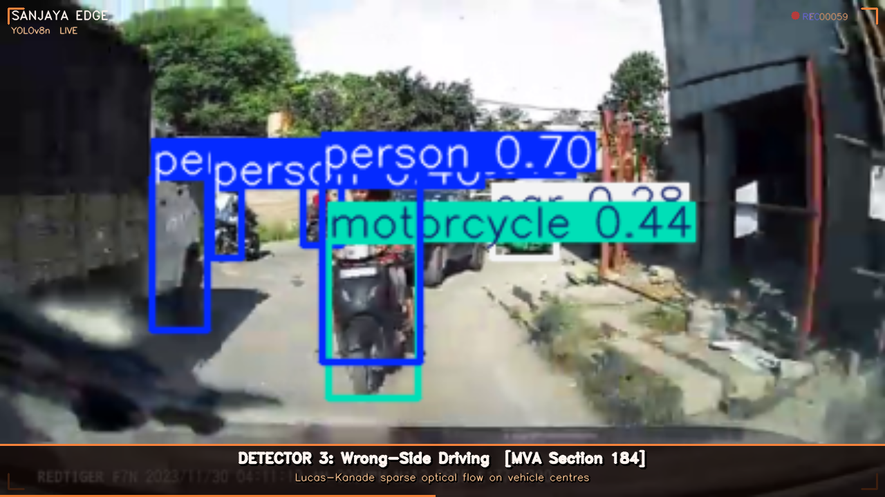

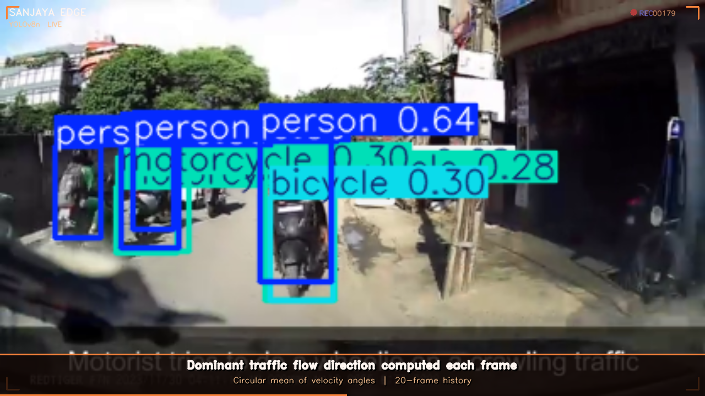

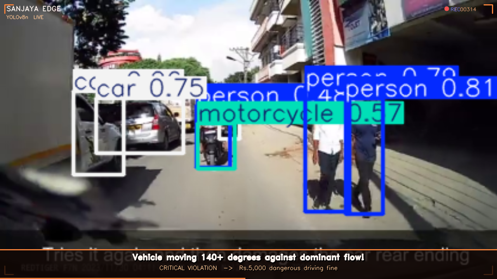

**How it works:**
1. Vehicle centres are extracted from YOLO detections each frame
2. **Lucas-Kanade sparse optical flow** tracks movement vectors between frames
3. Dominant traffic direction computed as a circular mean over a 20-frame history
4. Any vehicle moving > 140° away from the dominant direction is flagged
5. Confidence scales with the number of vehicles violating flow direction

---

## Detector 4 — Traffic Blocking / Gridlock

> **MVA Section 184 / IPC Section 283 · Fine: Rs.5,000 + Rs.2,000**

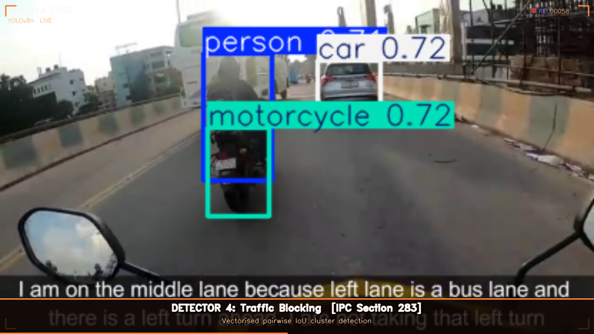

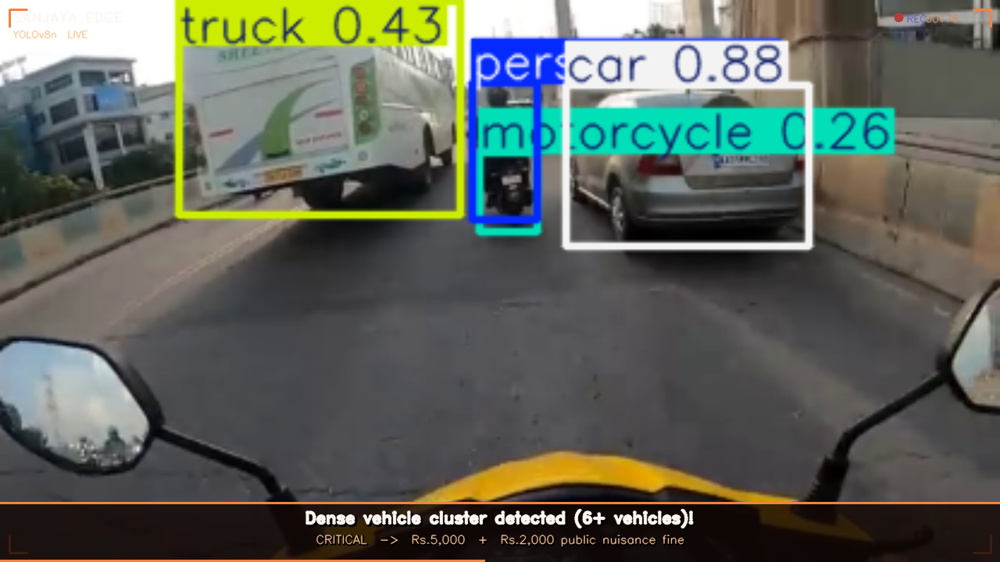

**How it works:**
1. All vehicle bounding boxes collected from each YOLO frame
2. **Vectorised pairwise IoU** checks which vehicles are densely packed
3. When 6+ vehicles form a cluster → **CRITICAL ALERT**
4. Confidence = `58 + (vehicle_count × 4.5)`, capped at 95%

---

## Detector 5 — Pedestrian in Active Lane

> **MVA Section 283 · Fine: Rs.500 (obstructing traffic)**

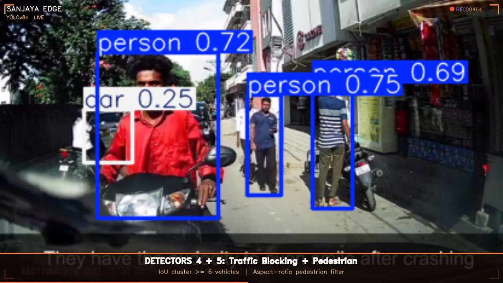

**How it works:**
1. All `person` detections with confidence > 38% are checked
2. Aspect ratio filter: height/width > 1.2 (standing pedestrian vs seated rider)
3. Zone filter: person must be in the central traffic lane, not footpath edges
4. Triggers **HIGH RISK** alert with pedestrian safety warning

---

## Architecture

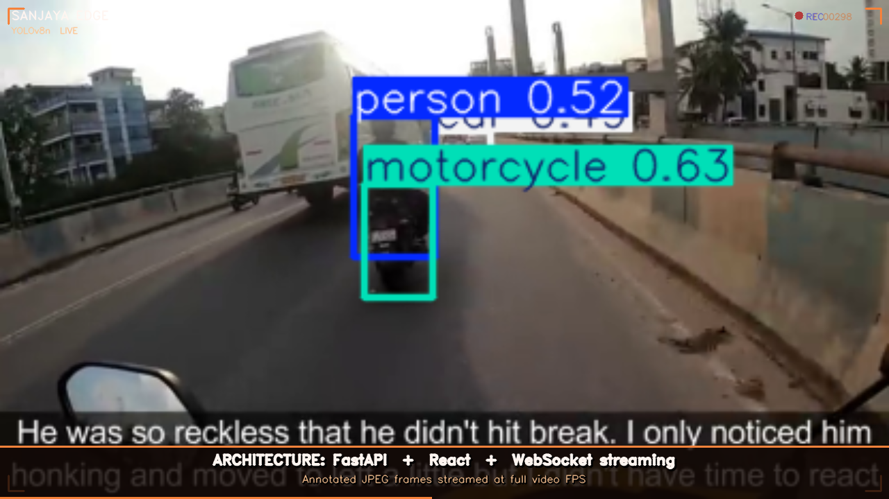

```
┌──────────────────────────────────────────┐      WebSocket  ws://localhost:8000
│  BACKEND  FastAPI · Python               │ ─── base64 JPEG + JSON alerts ────▶
│                                          │                                      ┌──────────────────────────────┐
│  YOLOv8n  ──▶  Thread Pool Executor      │ ◀── WS connect ─────────────────── │  FRONTEND  React · Vite      │
│  OpenCV HSV   traffic light colour       │                                      │                              │
│  Lucas-Kanade optical flow               │  /api/videos  video catalogue        │  Live annotated feed         │
│  IoU cluster  traffic blocking           │  /health      device + status        │  Compliance event log        │
│  rules.json   MVA + IPC legal DB         │                                      │  5-metric stats strip        │
└──────────────────────────────────────────┘                                      │  Voice co-pilot  (en-IN)     │
                                                                                  └──────────────────────────────┘
```

### Performance Optimisations

| Optimisation | Detail | Effect |
|---|---|---|
| Thread pool inference | `run_in_executor` — YOLO never blocks async event loop | Eliminates WebSocket frame stall |
| Input resize | Frames resized to 416px wide before YOLO | ~4× faster vs full-res |
| `imgsz=320` | Internal inference at 320px | ~2× faster vs default 640 |
| Frame skip SKIP=3 | YOLO every 3rd frame; results reused | ~3× fewer model calls |
| Output cap | JPEG Q60 · max 640px wide before WS send | ~60% smaller payload |
| Model warmup | Dummy forward pass at startup | No cold-start lag on frame 1 |
| CUDA auto-detect | `torch.cuda.is_available()` — GPU if present | Full acceleration on NVIDIA |

---

## Live Dashboard

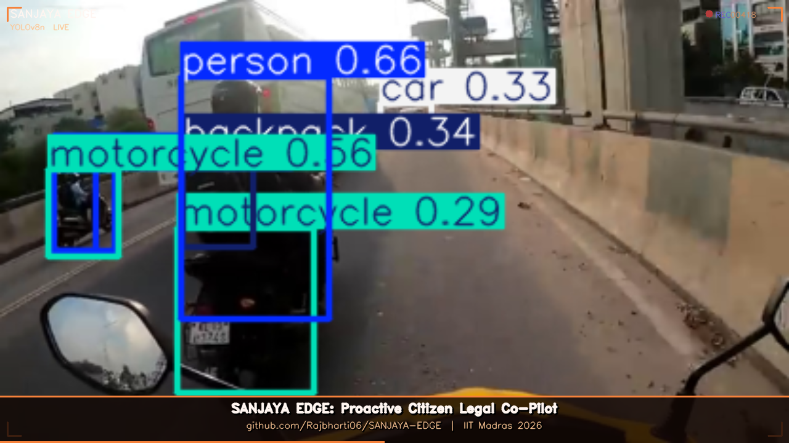

The dashboard shows in real time:

| Metric | Description |
|---|---|
| **Total Events** | All compliance checks this run |
| **Critical** | Red light + wrong-side + blocking violations |
| **High Risk** | Helmet + pedestrian violations |
| **Avg Confidence** | Mean YOLOv8n detection confidence % |
| **Fine Exposure** | Cumulative fine estimate (Rs.) for the session |

Every alert card shows:
- Violation name + exact law section
- Risk statement (why this is dangerous)
- National fine + TN / MH / KA state-specific penalties
- Frame number + timestamp

Voice co-pilot (Web Speech API · `en-IN`) reads each violation aloud with the fine amount.

---

## Legal Database

`backend/rules.json` covers 9 violation types, 3 Indian states:

```json
{
  "red_light": {
    "violation": "Red Light Jump",
    "law": "Motor Vehicles Act, Section 119",
    "fine_national": "Rs.1,000 (1st) / Rs.2,000 (repeat)",
    "fine_tn": "Rs.1,000",  "fine_mh": "Rs.1,000",  "fine_ka": "Rs.500",
    "severity": "CRITICAL"
  }
}
```

---

## Quick Start

### Backend
```bash
cd backend
pip install -r requirements.txt
uvicorn main:app --reload
# → http://localhost:8000
# → http://localhost:8000/health  (shows device: cpu/cuda)
```

### Frontend
```bash
cd frontend
npm install
npm run dev
# → http://localhost:5173
```

Open the browser → select a scenario → press **▶ START SCAN**

---

## Requirements

```
Python >= 3.11
fastapi==0.111.0  uvicorn[standard]==0.29.0
ultralytics==8.2.18  opencv-python==4.9.0.80  numpy==1.26.4

Node >= 18  ·  React 19  ·  Vite  ·  Tailwind CSS
CUDA optional — auto-detected, falls back to CPU transparently
```

---

## Project Structure

```
SANJAYA-EDGE/
├── backend/
│   ├── main.py             ← FastAPI server + all 5 detectors
│   ├── rules.json          ← Legal DB (9 violations · 3 states)
│   ├── requirements.txt
│   └── yolov8n.pt          ← YOLOv8n COCO model weights
├── frontend/
│   ├── src/
│   │   ├── App.jsx         ← Full dashboard UI (React)
│   │   └── index.css       ← Design system (Tailwind + custom)
│   └── index.html
├── Videos/                 ← 6 test videos (real Indian traffic)
├── screenshots/            ← 16 demo screenshots
├── demo.mp4                ← Full annotated demo with subtitle captions
├── demo_recorder.py        ← Script that generated demo.mp4
└── README.md
```

---

## Why Sanjaya Edge?

Most traffic enforcement is **reactive** — police-operated, post-incident, invisible to citizens.

Sanjaya Edge is **proactive and citizen-facing**: it explains *what law was broken*, *what the exact fine is*, and *which state rule applies* — in real time, from any camera. This turns every dashcam into a legal co-pilot and every citizen into an informed road safety participant.

---

<div align="center">

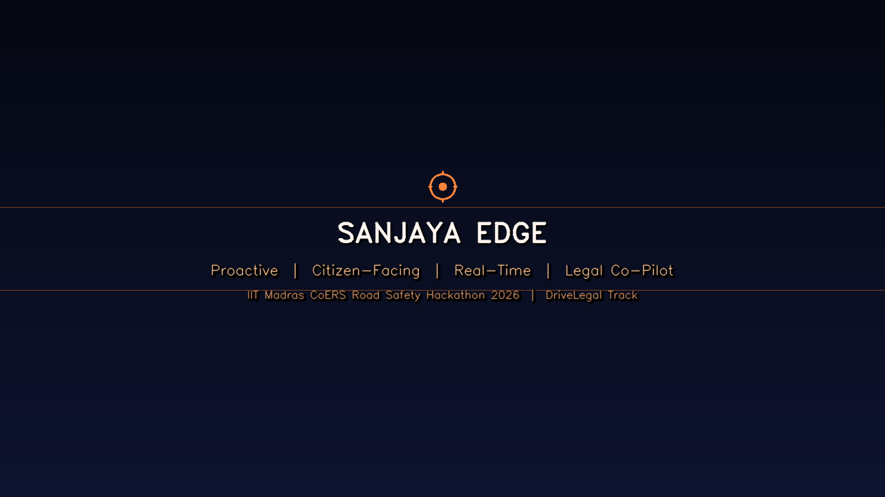

**IIT Madras CoERS Road Safety Hackathon 2026 · DriveLegal Track**

</div>
